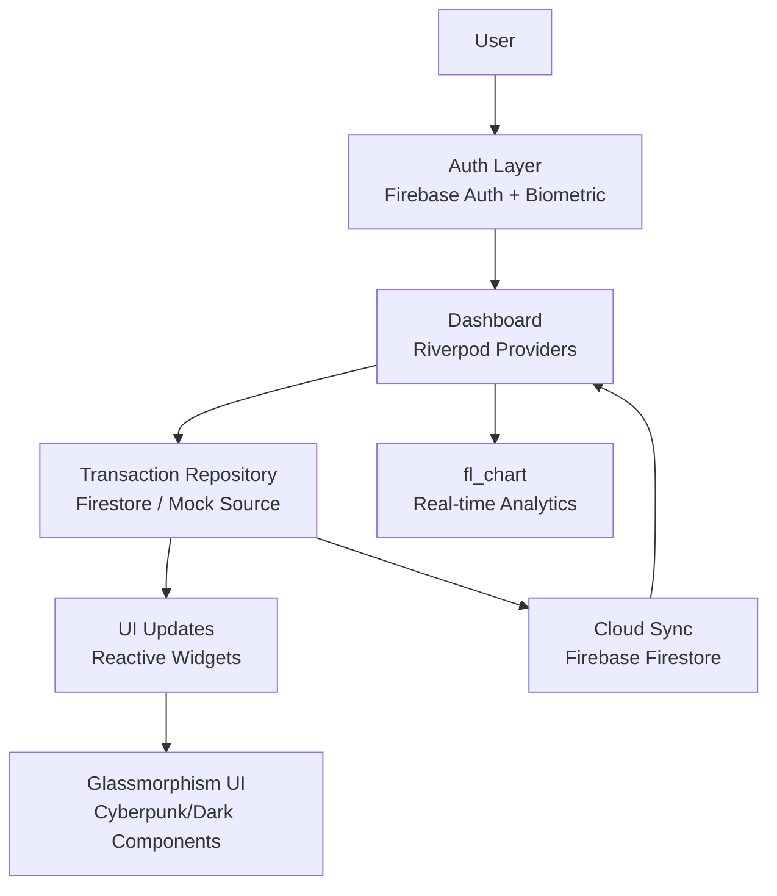

# LuxeVault - High-Performance Finance Tracker

LuxeVault is a high-performance, modern finance tracker engineered for speed, clarity, and reliability, featuring real-time data synchronization, secure biometric authentication, and a premium analytics-driven user experience.

## Screenshots


## PRD / Architecture Diagram



## Tech Stack

- Flutter
- Dart
- Riverpod
- Firebase
- Fl_chart
- Glassmorphism UI

## Features

- Real-time Analytics
- Cyberpunk/Dark UI
- Secure Auth
- Cloud Sync

## Getting Started

1. Install dependencies:

	```bash
	flutter pub get
	```

2. Configure Firebase for your local environment:

	```bash
	flutterfire configure
	```

3. Run the app:

	```bash
	flutter run
	```
