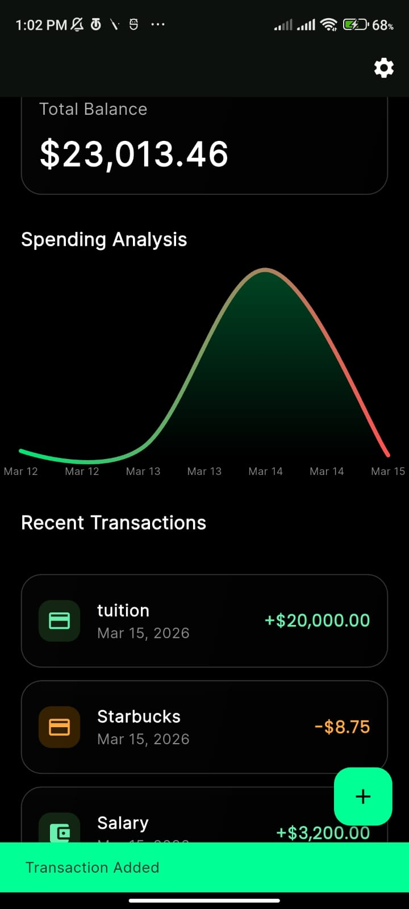
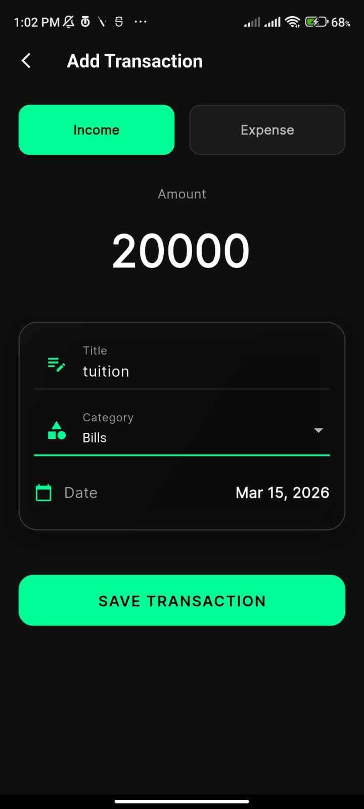
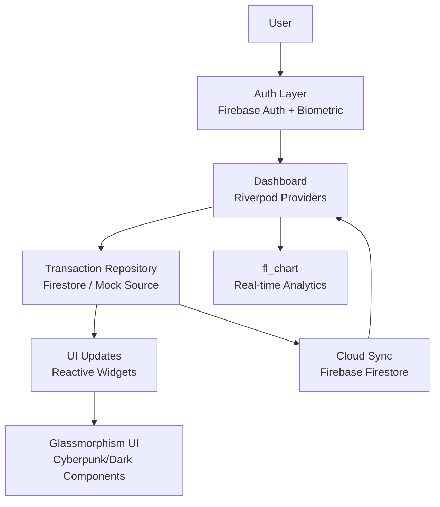

<h1 align="center">LuxeVault</h1>
<p align="center">A high-performance finance tracker built with Flutter — real-time sync, biometric auth, and analytics-first design.</p>

<p align="center">
  
  
  
  
</p>

---

## Overview

LuxeVault is a personal finance tracker focused on speed and clarity. Transactions sync in real-time via Firestore, charts update reactively with fl_chart, and authentication is handled through Firebase Auth with optional biometric unlock. The UI is built around a dark glassmorphism aesthetic designed for dense financial data.

---

## Screenshots

| Dashboard | Add Transaction |
|-----------|----------------|
|  |  |

---

## Features

- **Real-time sync** — Transactions reflect instantly across devices via Firestore listeners
- **Biometric authentication** — Secure app access with fingerprint / Face ID via Firebase Auth
- **Live analytics** — Interactive charts powered by fl_chart, driven by Riverpod providers
- **Glassmorphism UI** — Dark, cyberpunk-styled components built for readability at a glance
- **Offline-ready** — Firestore's local cache keeps the app functional without a connection

---

## Architecture



The app follows a reactive repository pattern. Riverpod providers sit between the UI and the data layer — widgets never talk to Firestore directly. The Transaction Repository abstracts both the live Firestore source and a mock source for development and testing.

---

## Tech Stack

| Layer | Technology |
|-------|-----------|
| Framework | Flutter + Dart |
| State management | Riverpod |
| Backend / Auth | Firebase (Firestore, Firebase Auth) |
| Charts | fl_chart |
| UI style | Glassmorphism / Dark theme |

---

## Getting Started

### Prerequisites

- Flutter SDK `>=3.0.0`
- A Firebase project with Firestore and Authentication enabled
- `flutterfire_cli` installed globally

### Setup

1. **Install dependencies**
   ```bash
   flutter pub get
   ```

2. **Connect Firebase**
   ```bash
   flutterfire configure
   ```
   Select your Firebase project and target platforms when prompted. This generates `firebase_options.dart` automatically.

3. **Run the app**
   ```bash
   flutter run
   ```

> For local development without Firebase, the app falls back to a mock data source automatically. No additional configuration needed.

---

## Project Structure

```
lib/
├── main.dart
├── app/                  # App entry, routing, theme
├── features/
│   ├── auth/             # Firebase Auth + biometric
│   ├── dashboard/        # Dashboard screen + providers
│   ├── transactions/     # Transaction repository + models
│   └── analytics/        # Chart logic + fl_chart widgets
└── shared/               # Common widgets, utilities
```

---

## License

MIT © LuxeVault
```
